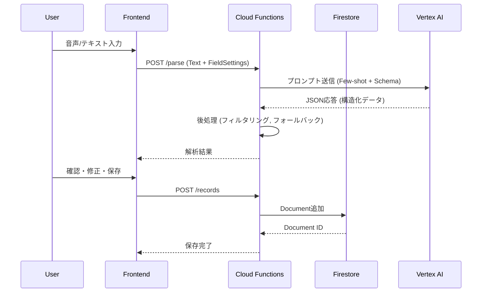
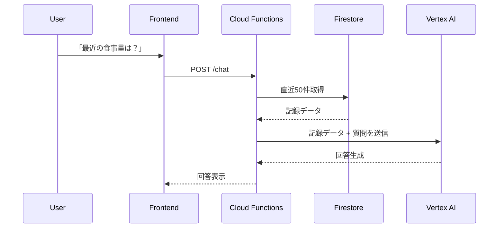

# アーキテクチャ設計書

## 1. システム概要

| 項目 | 値 |
|------|-----|
| **プロジェクト名** | AI介護記録アプリ (care-log-ai-jp) |
| **本番URL** | https://care-log-ai-jp.web.app |
| **API Base URL** | https://asia-northeast1-care-log-ai-jp.cloudfunctions.net |

**概要:** 音声または自然言語テキストで入力された介護記録をGoogle Gemini (Flashモデル) で解析・構造化し、保存・可視化するWebアプリケーション。

## 2. 技術スタック

| カテゴリ | 技術 | 選定理由 |
| --- | --- | --- |
| **Frontend** | React 18 + Vite 5 | 高速な開発とモダンなUI構築 |
| **Styling** | Tailwind CSS | レスポンシブ対応と迅速なデザイン適用 |
| **Hosting** | Firebase Hosting | GCPとの統合、無料枠が豊富 |
| **Backend** | Cloud Functions 2nd Gen | Workload Identityに対応、自動スケール |
| **Database** | Cloud Firestore | リアルタイム同期、スキーマレス、自動インデックス |
| **AI Model** | Vertex AI Gemini 2.5 Flash | Workload Identityによるキーレス認証、低遅延 |
| **CI/CD** | GitHub Actions | Workload Identity Federationでセキュアにデプロイ |

## 3. システム構成図

```
┌─────────────────────────────────────────────────────────────────┐
│                        ユーザー                                   │
└───────────────────────────┬─────────────────────────────────────┘
                            │
        ┌───────────────────┴───────────────────┐
        │                                       │
        ▼                                       ▼
┌───────────────────┐               ┌───────────────────────────┐
│  Firebase Hosting │               │     Cloud Functions       │
│  care-log-ai-jp   │               │  asia-northeast1          │
│  .web.app         │               │  care-log-ai-jp           │
│                   │               │  .cloudfunctions.net      │
│  - index.html     │  HTTPS API    │                           │
│  - assets/*.js    │ ────────────▶ │  /parse  (AI解析)         │
│  - assets/*.css   │               │  /records (CRUD)          │
│                   │               │  /chat    (RAG)           │
└───────────────────┘               └─────────────┬─────────────┘
                                                  │
                                    ┌─────────────┴─────────────┐
                                    │                           │
                                    ▼                           ▼
                          ┌─────────────────┐       ┌─────────────────┐
                          │    Firestore    │       │   Vertex AI     │
                          │   (データ保存)   │       │   Gemini 2.5    │
                          │   asia-northeast1│       │   Flash         │
                          └─────────────────┘       └─────────────────┘
```

## 4. データフロー

### 4.1 記録入力フロー (AI解析)


### 4.2 RAGチャットフロー (Context Injection)


## 5. セキュリティ設計

### 5.1 認証・認可
```
┌─────────────────────────────────────────────────────────────────┐
│                    Workload Identity Architecture               │
├─────────────────────────────────────────────────────────────────┤
│                                                                  │
│  ┌─────────────────┐       ┌─────────────────┐                  │
│  │  Cloud Functions │       │    Vertex AI    │                  │
│  │                  │       │                  │                  │
│  │  認証方式:       │  ───▶ │  認証方式:       │                  │
│  │  ADC (自動)      │       │  Workload       │                  │
│  │                  │       │  Identity       │                  │
│  └─────────────────┘       └─────────────────┘                  │
│         │                                                        │
│         │ ADC (Application Default Credentials)                  │
│         ▼                                                        │
│  ┌─────────────────┐                                             │
│  │    Firestore    │                                             │
│  │                  │                                             │
│  │  認証: ADC       │  ※ サービスアカウントキー不要               │
│  └─────────────────┘                                             │
│                                                                  │
└─────────────────────────────────────────────────────────────────┘
```

### 5.2 CI/CD認証 (GitHub Actions)
- **Workload Identity Federation:** OIDCトークンベースの認証
- **サービスアカウント:** `github-actions@care-log-ai-jp.iam.gserviceaccount.com`
- **キーレス:** サービスアカウントキーの発行・管理不要

## 6. 技術的注意点

### 6.1 AI解析の後処理
Parse APIでは以下の後処理を実施:
1. **不要フィールド除去:** `notes`, `title` などの汎用フィールド
2. **無効値除去:** `null`, `"null"`, `""`, `"なし"` など
3. **タイプ別フィルタ:** 記録タイプに応じた有効フィールドのみ保持
4. **フォールバック抽出:** AI抽出失敗時の正規表現補完

### 6.2 Superset Schema 戦略
Gemini APIの `responseSchema` 制約により、Few-Shot例で使用するすべてのキーがスキーマに含まれている必要がある。`ALL_KNOWN_KEYS` ですべての既知キーを常にスキーマに含める。

### 6.3 予約語回避
JavaScriptの予約語との衝突を避けるため、排泄種類は `type` ではなく `excretion_type` を使用。

## 7. 関連ドキュメント

| ドキュメント | 説明 |
|-------------|------|
| [GCP移行計画書](./GCP_MIGRATION_PLAN.md) | Vercel→GCP移行の詳細 |
| [CI/CD設計書](./CICD_DESIGN.md) | GitHub Actions設定 |
| [データベース設計](./DATABASE_SCHEMA.md) | Firestoreスキーマ |
| [API仕様書](./API_REFERENCE.md) | エンドポイント詳細 |
| [AI解析改善計画](./AI_PARSING_IMPROVEMENT.md) | プロンプト最適化 |
| [音声入力仕様書](./VOICE_INPUT_SPEC.md) | Web Speech API実装 |
| [テストレポート](./TEST_REPORT.md) | APIテスト結果 |
| [変更履歴](./CHANGELOG.md) | バージョン履歴 |

## 8. Phase 1 完了ステータス

**2025-12-10: 第一次開発フェーズ完了 🎉**

| 項目 | 状態 |
|------|------|
| GCP/Firebase移行 | ✅ 完了 |
| AI解析 (Parse API) | ✅ 及第点 |
| 記録管理 (Records API) | ✅ 及第点 |
| RAGチャット (Chat API) | ✅ 及第点 |
| 音声入力 | ⚠️ 制限あり (長時間使用でもたつき) |
| CI/CD | ✅ 自動デプロイ稼働中 |

**本番テスト利用開始可能**

---

*最終更新: 2025-12-10 (Phase 1 完了)*
