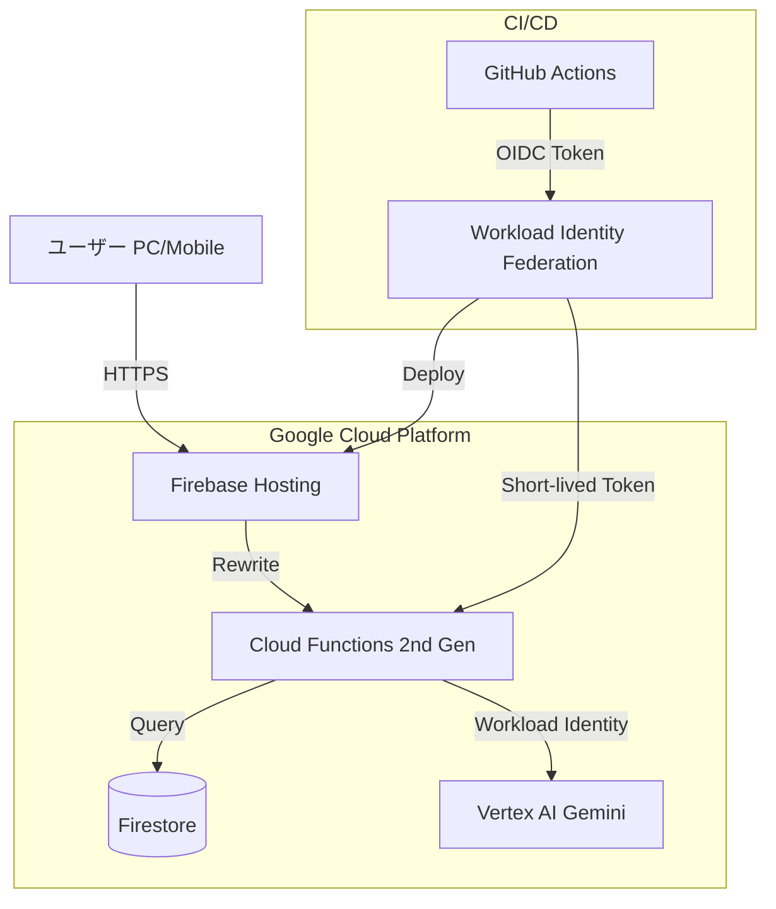
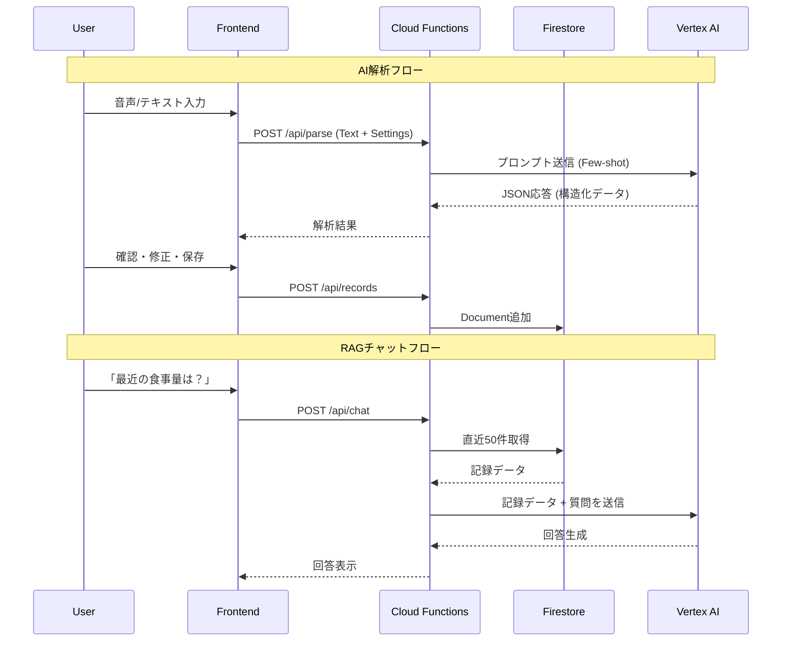

# アーキテクチャ設計書

## 1. システム概要

**プロジェクト名:** AI介護記録アプリ (care-log-ai-jp)
**概要:** 音声または自然言語テキストで入力された介護記録をGoogle Gemini (Flashモデル) で解析・構造化し、保存・可視化するWebアプリケーション。

## 2. 技術スタック

### 2.1 現行 (Vercel)

| カテゴリ | 技術 | 選定理由 |
| --- | --- | --- |
| **Frontend** | React (Vite) | 高速な開発とモダンなUI構築のため |
| **Styling** | Tailwind CSS | レスポンシブ対応と迅速なデザイン適用 |
| **Backend** | Vercel Functions (Node.js) | サーバーレスで運用コストを抑えつつAPIを提供 |
| **Database** | Vercel Postgres (Neon) | Vercelとの親和性が高く、JSONB型による柔軟なデータ保存が可能 |
| **AI Model** | Google Gemini 2.5 Flash | 低遅延・低コストかつ高い日本語処理能力 |

### 2.2 移行先 (GCP/Firebase)

| カテゴリ | 技術 | 選定理由 |
| --- | --- | --- |
| **Frontend** | React (Vite) | 変更なし |
| **Hosting** | Firebase Hosting | GCPとの統合、無料枠が豊富 |
| **Backend** | Cloud Functions (2nd Gen) | Vercelより制限が緩く、Workload Identityに対応 |
| **Database** | Firestore | リアルタイム同期、スケーラビリティ |
| **AI Model** | Vertex AI Gemini | Workload Identityによるキーレス認証 |
| **CI/CD** | GitHub Actions | Workload Identity Federationでセキュアにデプロイ |

## 3. システム構成図

### 3.1 GCP移行後アーキテクチャ



## 4. データフロー

### 4.1 記録入力フロー (AI解析)
1. ユーザーが音声/テキストを入力。
2. Frontendが `/api/parse` をコール。この際、**現在のフィールド設定(Master)** も送信する。
3. BackendがVertex AI Geminiにプロンプトを送信。「ユーザーの入力を指定されたフィールドにマッピング」するように指示。
4. GeminiがJSONデータを返却。
5. Frontendで結果を表示し、ユーザーが確認・修正後に保存 (`/api/records` POST)。

### 4.2 RAGチャットフロー (Context Injection)
1. ユーザーが質問を入力。
2. Frontendが `/api/chat` をコール。
3. BackendがFirestoreから**直近50件**の記録を取得 (Context Injection)。
4. 取得した記録とユーザーの質問を合わせてGeminiに送信。
5. Geminiが記録に基づいた回答を生成し、返却。



## 5. 技術的注意点

### 5.1 Superset Schema 戦略
Gemini APIの `responseSchema` は、Few-Shot例に含まれるキーがスキーマに未定義だとエラーを返す。この問題を回避するため、`ALL_KNOWN_KEYS` ですべての既知キーを常にスキーマに含める。

### 5.2 予約語回避
JavaScriptの予約語との衝突を避けるため、排泄種類は `type` ではなく `excretion_type` を使用。

### 5.3 後方互換性
既存データ（`type`キー）との互換性のため、表示コンポーネントではフォールバック処理を実装。

```typescript
const excType = details.excretion_type || details.type || '';
```

### 5.4 Workload Identity Federation
GitHub ActionsからGCPへのデプロイは、サービスアカウントキーではなくWorkload Identity Federation (OIDC)を使用。これにより：
- キー漏洩リスクがゼロ
- ローテーション不要
- 短命トークンによるセキュリティ向上

## 6. 関連ドキュメント

- [GCP移行計画書](./GCP_MIGRATION_PLAN.md)
- [CI/CD設計書](./CICD_DESIGN.md)
- [データベース設計](./DATABASE_SCHEMA.md)
- [API仕様書](./API_REFERENCE.md)

---

*最終更新: 2025-12-10*
