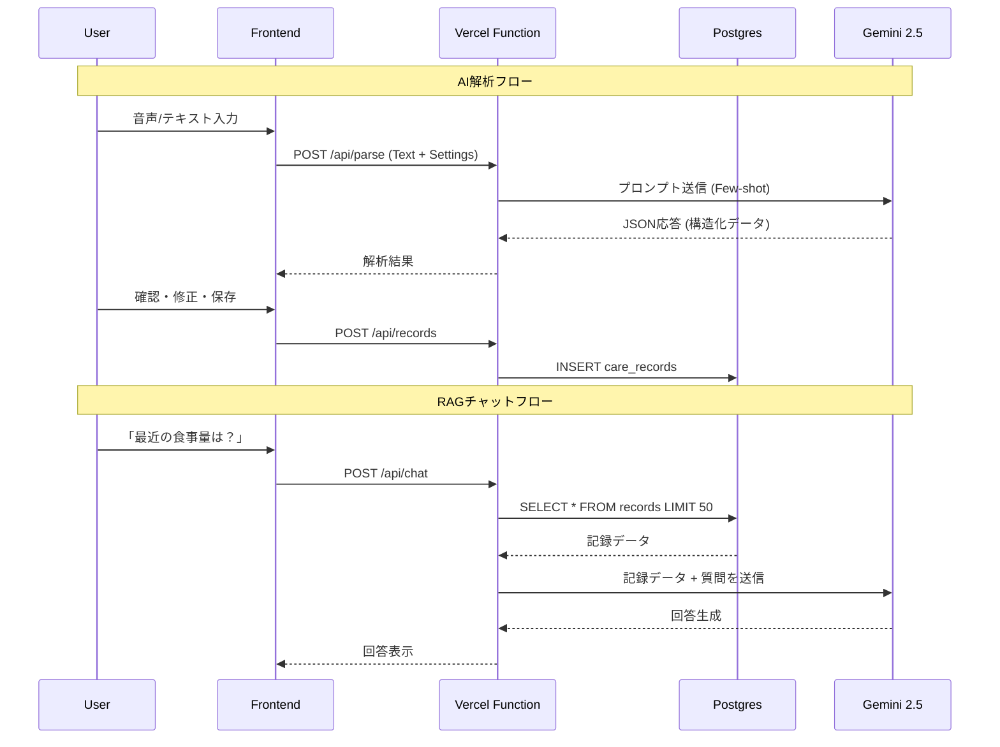

# アーキテクチャ設計書

## 1. システム概要
**プロジェクト名:** AI介護記録アプリ (care-log-ai-jp)
**概要:** 音声または自然言語テキストで入力された介護記録をGoogle Gemini (Flashモデル) で解析・構造化し、Vercel Postgresに保存・可視化するWebアプリケーション。

## 2. 技術スタック

| カテゴリ | 技術 | 選定理由 |
| --- | --- | --- |
| **Frontend** | React (Vite) | 高速な開発とモダンなUI構築のため |
| **Styling** | Tailwind CSS | レスポンシブ対応と迅速なデザイン適用 |
| **Backend** | Vercel Functions (Node.js) | サーバーレスで運用コストを抑えつつAPIを提供 |
| **Database** | Vercel Postgres (Neon) | Vercelとの親和性が高く、JSONB型による柔軟なデータ保存が可能 |
| **AI Model** | Google Gemini 2.5 Flash | 低遅延・低コストかつ高い日本語処理能力 |
| **Visualization** | Recharts | 統計データの可視化 |

## 3. システム構成図

```mermaid
graph TD
    User[ユーザー (PC/Mobile)] -->|HTTPS / UI操作| FE[Frontend (React/Vite)]
    
    subgraph Vercel Platform
        FE -->|API Call| API[Serverless Functions (/api)]
        
        API -->|SQL Query| DB[(Vercel Postgres)]
        API -->|GenAI Request| AI[Google Gemini API]
    end
    
    subgraph External Services
        AI -->|Response| API
        DB -->|Result| API
    end
```

## 4. データフロー

### 4.1 記録入力フロー (AI解析)
1. ユーザーが音声/テキストを入力。
2. Frontendが `/api/parse` をコール。この際、**現在のフィールド設定(Master)** も送信する。
3. BackendがGemini APIにプロンプトを送信。「ユーザーの入力を指定されたフィールドにマッピング」するように指示。
4. GeminiがJSONデータを返却。
5. Frontendで結果を表示し、ユーザーが確認・修正後に保存 (`/api/records` POST)。

### 4.2 RAGチャットフロー (簡易実装)
1. ユーザーが質問を入力。
2. Frontendが `/api/chat` をコール。
3. BackendがDBから**直近50件**の記録を取得 (Context Injection)。
4. 取得した記録とユーザーの質問を合わせてGeminiに送信。
5. Geminiが記録に基づいた回答を生成し、返却。


