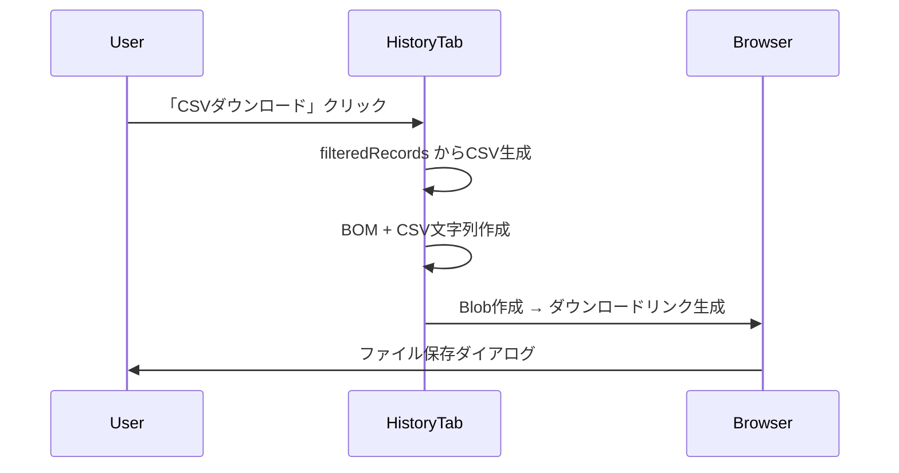

# CSVエクスポート機能 設計書

## 1. 概要

### 1.1 目的
履歴タブに表示される介護記録データをCSVファイルとしてダウンロードできるようにする。

### 1.2 ユースケース
- **データバックアップ**: ローカルへの記録保存
- **他システム連携**: Excel等での分析・報告書作成
- **監査対応**: 記録の外部出力要件への対応

### 1.3 対象ユーザー
- 介護施設の記録担当者
- 管理者（レポート作成）

---

## 2. 設計方針

### 2.1 アーキテクチャ選択肢

| 方式 | 実装場所 | メリット | デメリット |
|------|----------|----------|------------|
| **A. フロントエンド生成** | HistoryTab.tsx | シンプル、即座にダウンロード | 大量データ時のメモリ負荷 |
| **B. バックエンド生成** | Cloud Functions | 大量データ対応、一貫したフォーマット | API追加開発が必要 |
| **C. ハイブリッド** | 両方 | 柔軟性 | 複雑性増加 |

### 2.2 推奨方式: **A. フロントエンド生成**

**理由:**
1. 現在の記録数は最大100件（API制限）で、フロントエンドで十分処理可能
2. 追加のAPI開発が不要
3. ユーザーが現在表示中のフィルタ結果をそのままエクスポート可能
4. 即座のフィードバック（ダウンロード開始）

**将来拡張:**
- 大量データ対応が必要になった場合、バックエンドAPIを追加

---

## 3. 機能仕様

### 3.1 基本機能

| 項目 | 仕様 |
|------|------|
| **トリガー** | 「CSVダウンロード」ボタンクリック |
| **対象データ** | 現在表示中の記録（フィルタ・ソート適用後） |
| **ファイル名** | `care_records_YYYYMMDD_HHmmss.csv` |
| **文字コード** | UTF-8 with BOM（Excel互換） |
| **区切り文字** | カンマ (`,`) |

### 3.2 CSVカラム構成

```csv
id,記録日時,種類,種類コード,主食内容,副食内容,摂取率(%),水分種類,水分量(ml),排泄種類,量,性状・状態,失禁有無,体温(℃),血圧(上),血圧(下),脈拍,SpO2(%),入浴形態,皮膚状態,特記事項,件名,詳細
```

**カラム設計方針:**
1. **共通カラム**: `id`, `記録日時`, `種類`, `種類コード`
2. **詳細カラム**: 全記録タイプの`details`フィールドを横展開（Union方式）
3. **空セル**: 該当しないフィールドは空文字

### 3.3 データ変換ルール

| 元データ | CSV出力 |
|----------|---------|
| `recorded_at` (ISO8601) | `YYYY/MM/DD HH:mm` |
| `record_type` | 日本語ラベル (`meal` → `食事`) |
| `details.xxx` | 対応カラムに展開 |
| `null` / `undefined` | 空文字 |
| カンマ含む値 | ダブルクォートで囲む |
| 改行含む値 | ダブルクォートで囲む |

---

## 4. UI設計

### 4.1 ボタン配置

```
┌─────────────────────────────────────────────────────────────┐
│  [フィルタ: すべての記録 ▼]     [新しい順 ↕]  [📥 CSVダウンロード] │
└─────────────────────────────────────────────────────────────┘
```

- **位置**: コントロールバー右端
- **アイコン**: `Download` (lucide-react)
- **ラベル**: 「CSVダウンロード」
- **状態**:
  - 通常: 青系ボタン
  - ローディング: スピナー表示
  - 無効: 記録0件時はグレーアウト

### 4.2 インタラクション



---

## 5. 実装設計

### 5.1 新規追加コード (HistoryTab.tsx)

```typescript
// CSVエクスポート関数
const exportToCsv = () => {
  if (filteredRecords.length === 0) return;

  // 1. ヘッダー定義
  const headers = [
    'id', '記録日時', '種類', '種類コード',
    // 全フィールドを列挙
    ...getAllDetailKeys()
  ];

  // 2. データ行生成
  const rows = filteredRecords.map(record => {
    const row = [
      record.id,
      formatDate(record.recorded_at),
      RECORD_TYPE_LABELS[record.record_type],
      record.record_type,
      ...getDetailValues(record)
    ];
    return row.map(escapeCsvValue).join(',');
  });

  // 3. CSV文字列作成 (BOM付きUTF-8)
  const bom = '\uFEFF';
  const csvContent = bom + [headers.join(','), ...rows].join('\n');

  // 4. ダウンロード実行
  const blob = new Blob([csvContent], { type: 'text/csv;charset=utf-8;' });
  const url = URL.createObjectURL(blob);
  const link = document.createElement('a');
  link.href = url;
  link.download = `care_records_${formatTimestamp()}.csv`;
  link.click();
  URL.revokeObjectURL(url);
};

// CSVエスケープ処理
const escapeCsvValue = (value: any): string => {
  if (value === null || value === undefined) return '';
  const str = String(value);
  if (str.includes(',') || str.includes('"') || str.includes('\n')) {
    return `"${str.replace(/"/g, '""')}"`;
  }
  return str;
};
```

### 5.2 ヘルパー関数

```typescript
// 全記録タイプのdetailsキーを取得
const getAllDetailKeys = (): string[] => {
  const allKeys = new Set<string>();
  Object.values(fieldSettings).forEach(settings => {
    settings.forEach(s => allKeys.add(s.key));
  });
  return Array.from(allKeys);
};

// ラベル付きヘッダー生成
const getHeaderLabels = (): string[] => {
  return getAllDetailKeys().map(key => {
    for (const settings of Object.values(fieldSettings)) {
      const found = settings.find(s => s.key === key);
      if (found) return found.label;
    }
    return key;
  });
};
```

### 5.3 ボタンコンポーネント

```tsx
import { Download } from 'lucide-react';

<button
  onClick={exportToCsv}
  disabled={filteredRecords.length === 0}
  className="flex items-center gap-2 text-sm font-bold text-white bg-blue-600 px-4 py-2.5 rounded-lg hover:bg-blue-700 transition-colors disabled:bg-gray-300 disabled:cursor-not-allowed"
>
  <Download className="w-4 h-4" />
  CSVダウンロード
</button>
```

---

## 6. テスト計画

### 6.1 機能テスト

| テストケース | 期待結果 |
|--------------|----------|
| 全記録ダウンロード | 全件がCSVに含まれる |
| フィルタ後ダウンロード | フィルタ結果のみ出力 |
| 0件時ボタンクリック | 何も起きない（ボタン無効化） |
| 日本語データ | 文字化けなし（Excel確認） |
| カンマ含むデータ | 正しくエスケープ |
| 改行含むデータ | 正しくエスケープ |

### 6.2 互換性テスト

| ソフトウェア | 確認項目 |
|--------------|----------|
| Microsoft Excel | 日本語表示、カラム分割 |
| Google Sheets | インポート正常 |
| LibreOffice Calc | 文字コード認識 |

---

## 7. 実装計画

### Phase 1: 基本実装 (推定作業量: 小)

1. `HistoryTab.tsx` にエクスポート関数追加
2. CSVダウンロードボタン追加
3. 基本的なCSV生成ロジック実装
4. 手動テスト

### Phase 2: 拡張 (オプション)

1. エクスポート範囲選択UI（日付範囲指定）
2. カラム選択機能
3. バックエンドAPI (`GET /records/export`)

---

## 8. セキュリティ考慮

| 項目 | 対応 |
|------|------|
| データ漏洩 | CSVはローカル生成のみ（サーバー保存なし） |
| XSS | Blob API使用、DOMインジェクションなし |
| 個人情報 | ユーザー認証導入時に要検討（Phase 2） |

---

## 9. 関連ドキュメント

- [API仕様書](./API_REFERENCE.md)
- [データベース設計](./DATABASE_SCHEMA.md)
- [アーキテクチャ設計](./ARCHITECTURE.md)

---

*作成日: 2025-12-10*
*ステータス: ✅ 実装完了 (Phase 1)*
